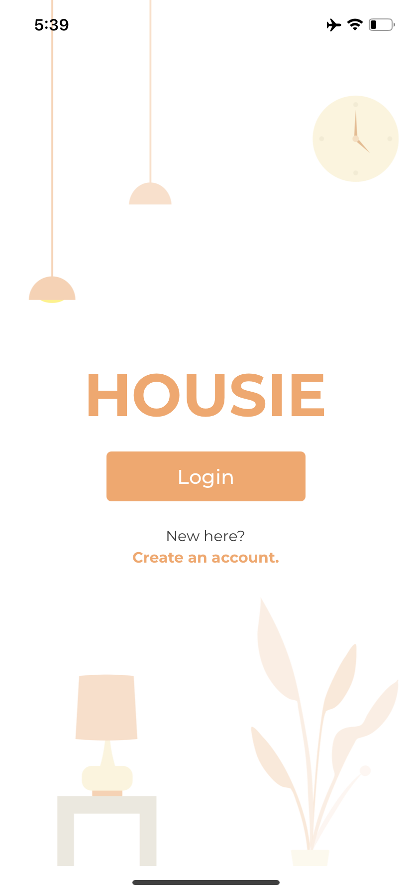
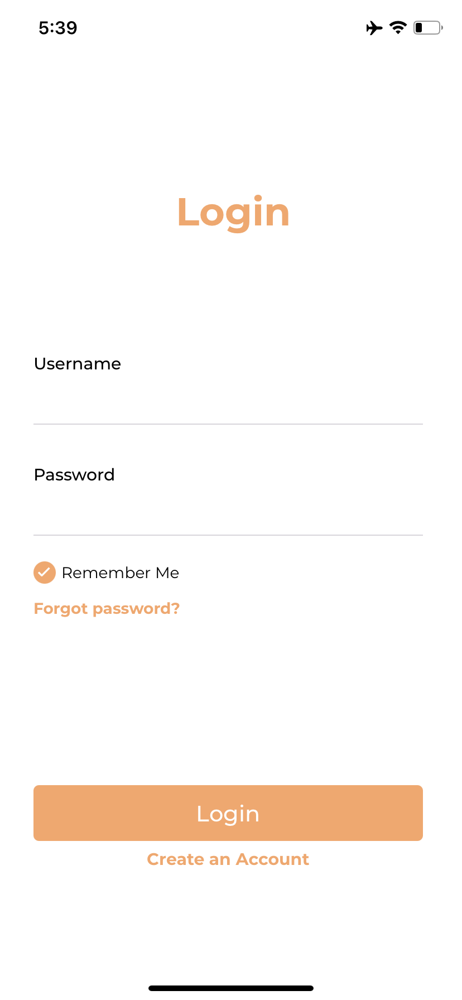
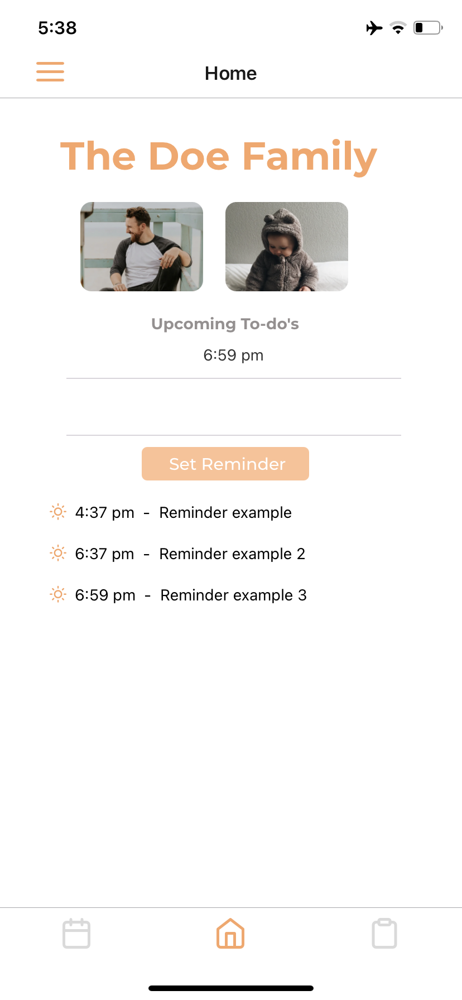
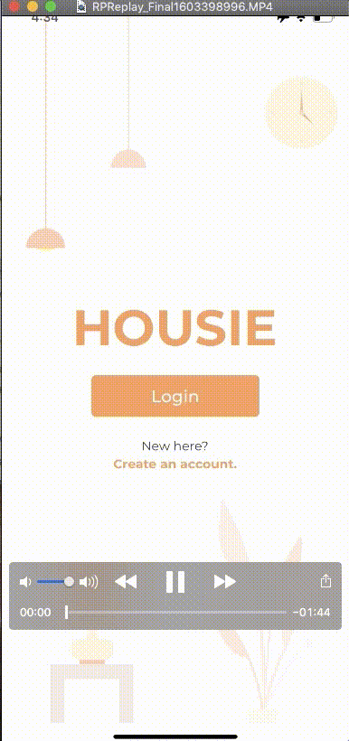
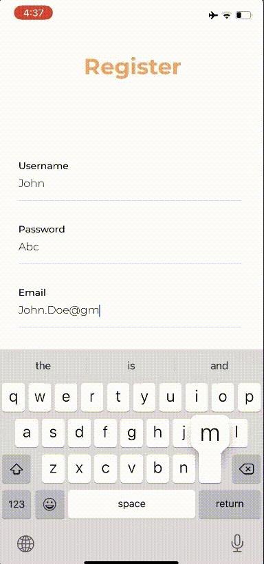

<p align="center"></p>
<h1 align="center"> <b> Housie </b> </h>

#### Housie is a simple reminder app for families. Users can create a personalized profile, create reminders, jot down notes, and refer to a calendar. This project was a personal learning activity for React Native so the app uses dummy user data and doesn't store any information. 

<br>

### <b> App Overview </b>
<p float="left">
  
   
  
</p>

<br> 

### <b> Login </b>


&nbsp;

### <b> Image Upload </b>


&nbsp;

### <b> Registration </b>


&nbsp;

### <b> Note Taking & Calendar </b>


&nbsp;

### <b> Run The App Locally </b>
```sh
$ expo start 
$ i or scan QR on Expo App (iOS)
```